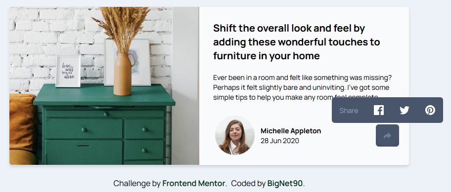
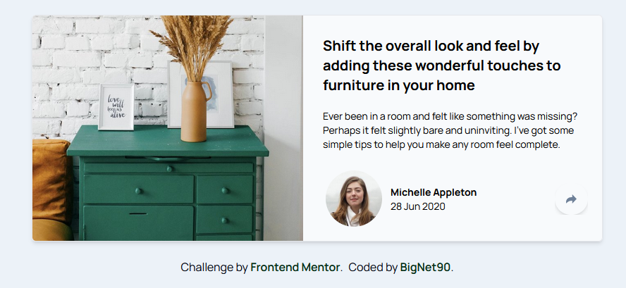
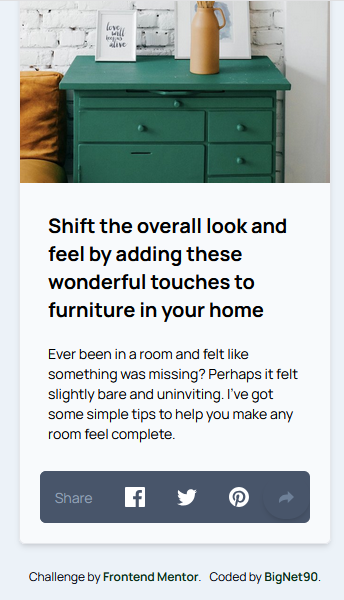
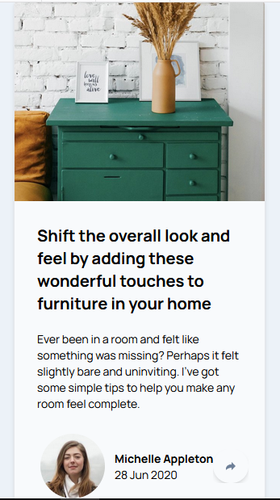

# Frontend Mentor - Article preview component solution

This is a solution to the [Article preview component challenge on Frontend Mentor](https://www.frontendmentor.io/challenges/article-preview-component-dYBN_pYFT). Frontend Mentor challenges help you improve your coding skills by building realistic projects. 

## Table of contents

- [Overview](#overview)
  - [The challenge](#the-challenge)
  - [Screenshot](#screenshot)
- [My process](#my-process)
  - [Built with](#built-with)
  - [What I learned](#what-i-learned)
  - [Continued development](#continued-development)
  - [Useful resources](#useful-resources)
- [Author](#author)


## Overview

### The challenge

Users should be able to:

- View the optimal layout for the component depending on their device's screen size
- See the social media share links when they click the share icon

### Screenshot







## My process

### Built with

- Semantic HTML5 markup
- Tailwind CSS
- Flexbox
- CSS Grid
- Mobile-first workflow
- JavaScript


### What I learned

I learnt styling with Tailwindcss and some JavaScript for some user events on a webpage. 

To see how you can add code snippets, see below:

```html
<body class="grid  align-middle w-screen bg-lgb manrope-font">
  <main class="grid justify-center text-sm box-border  p-6">
    <!-- General Container -->
    <div class=" container rounded-md overflow-hidden border shadow-md bg-slate-50 md:flex ">
      
```
```js
share.addEventListener('click', () => {

    if (shareMenu.classList.contains('hidden')) {
        shareMenu.classList.remove('hidden');

    } else {
        shareMenu.classList.add('hidden')
    }
})
// Hide the profile on user click on small screens
share.addEventListener('click', () => {
    if (avatar.classList.contains('#avatar')) {
        avatar.classList.remove('#avatar');

    } else {
        avatar.classList.add('hidden')
    }


})

```


### Continued development

Currently, i am learning JavaScript programming language. And this project being the first project which I used Tailwindcss for the styling, as it made styling the project very smooth and easier. I hope to continue to learn and improve Tailwind skills. And hoping very soon I'll incorporate the use of a JavaScript framework in my projects in the future. 

### Useful resources

- [Tailwind Documentation](https://www.Tailwindcss.com) - This really assisted in styling my project.

## Author
ABUBAKAR SADIQ UZAIFAH 
- Email - (abubakaruzaifah@gmail.com)
- Website -(https://www.vercel.com)
- Frontend Mentor -(https://www.frontendmentor.io/profile/BigNet90)
- Twitter -(https://www.twitter.com/Abusadeeq90)
- Github - (https://www.github.com/BigNet90)


